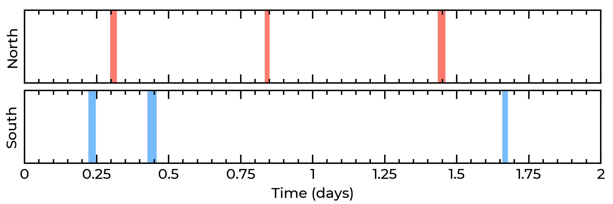

# MASER
MASER (**M**agnetically inter**A**cting **S**tars and **E**xoplanets in the **R**adio) is a tool for computing the visibility of radio emission produced by magnetic star-planet interactions over time. It calculates the geometry of these interactions on the fly from the relevant system parameters. While it was developed for research on planet-hosting M-dwarfs, it is well suited for application to any magnetised body that can interact with an orbiting satellite (e.g. planets, brown dwarfs, white dwarfs). It is written in Python, and is described in [Kavanagh & Vedantham (2023)](https://doi.org/10.1093/mnras/stad2035). It can be installed on Unix systems as described below, or alternatively used via its dedicated web app (coming soon).

# Installation
MASER can be installed on Unix systems via `pip`:
```
pip install git+https://github.com/robkavanagh/maser.git
```
Its sole dependency is NumPy (>version 1.23).

# Basic usage
Once installed, you can utilise MASER in your Python workflow via:
```
from maser import maser
```
The function `maser` requires the vector `params`, which contains the system parameters required to compute the visibility of the radio emission generated via the magnetic star-planet interactions, and the NumPy array `times`, which contains the observing times in days. The elements of `params` and their associated units are as follows:

**Star:**
- `M_s`: Mass (solar masses)
- `R_s`: Radius (solar radii)
- `P_s`: Rotation period (days)
- `i_s`: Inclination of the rotation axis relative to the line of sight (radians)
- `B_s`: Dipole field strength at the magnetic poles (Gauss)
- `beta`: Magnetic obliquity (radians)
- `phi_s0`: Rotation phase at ``times = 0`` (0 – 1)

**Planet:**
- `a`: Orbital distance (stellar radii)
- `i_p`: Inclination of the orbital axis relative to the line of sight (radians)
- `lam`: Projected spin-orbit angle (radians)
- `phi_p0`: Orbital phase at ``times = 0`` (0 – 1)

**Emission:**
- `f`: Observing frequency (MHz)
- `alpha`: Cone opening angle (radians)
- `dalpha`: Cone thickness (radians)

Two optional parameters, `Lmax` and `tol`, can also be set when calling `maser`, which set the maximum size of the magnetic field loops and the tolerance of the numerical solver implemented. For more details, see the [associated publication](https://doi.org/10.1093/mnras/stad2035).

# Example calculation
The script `examples/plot.py` provides an example of using MASER to compute the visibility of radio emission from a star-planet system observed over two days. Calling `maser(params, times)` returns two arrays corresponding to the visibility of the emission from the Northern and Southern magnetic hemispheres of the star at each time in `times`. Visible emission is represented with the value `True`, whereas emission that is either not visible or cannot be generated is represented with the value `False`. The visibility windows of emission from the North and South (coloured red and blue respectively) should resemble the following time series:

<p align="center">

</p>

# Use cases
MASER has been utilised for a variety of science cases. The published use cases as of Feb 2026 are as follows:
- Assessing the geometric dependence of pulse durations from long period radio transients [(Zhong & Most 2025)](https://doi.org/10.48550/arXiv.2509.09057)
- Interpreting the non-detection of magnetic star-planet interactions [(Peña-Moñino et al. 2025)](https://doi.org/10.1051/0004-6361/202451835)


# Acknowledging use of the code
If you use MASER in your own work, please cite [Kavanagh & Vedantham (2023)](https://doi.org/10.1093/mnras/stad2035).
