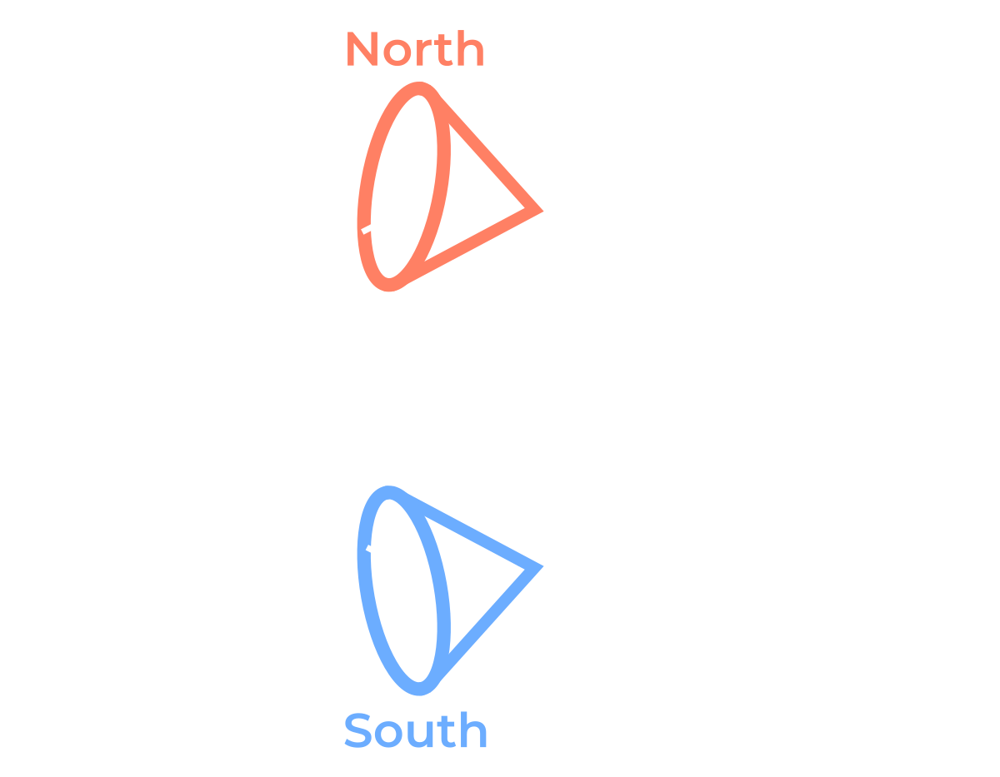
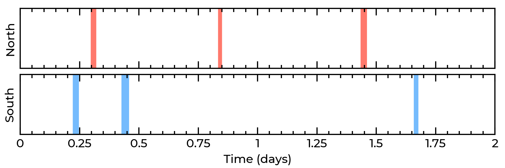

# MASER
MASER is a tool I developed for computing the visibility windows of radio emission generated by magnetic interactions between stars and their orbiting planets. This emission is emitted in a hollow cone shape from the Northern and Southern magnetic hemispheres of the host star, as illustrated below:

<p align='center'>

</p>

MASER is written in Python, and is described in the publication [Kavanagh & Vedantham (2023)](https://doi.org/10.1093/mnras/stad2035). While it was developed for studying star-planet interactions, MASER can be applied to any magnetised body that interacts with an orbiting satellite (e.g. planets, brown dwarfs, white dwarfs).

The installation steps for MASER are listed below. If you prefer a more interactive approach, I recommend you try out the dedicated [web app](https://maser.robkavanagh.xyz/)!

# Installation and basic usage
MASER can be installed via `pip`, and depends solely on NumPy (>1.23):
```
pip install git+https://github.com/robkavanagh/maser.git
```
Once installed, you can utilise it in your Python workflow via:
```
from maser import maser
```
The function `maser` requires the vector `params`, which contains the system parameters required to compute the visibility of the radio emission, and the NumPy array `times`, which contains the observing times in days. The elements of `params` are as follows:

**Star:**
- `M_s`: Mass (solar masses)
- `R_s`: Radius (solar radii)
- `P_s`: Rotation period (days)
- `i_s`: Inclination of the rotation axis relative to the line of sight (radians)
- `B_s`: Dipole field strength at the magnetic poles (Gauss)
- `beta`: Magnetic obliquity (radians)
- `phi_s0`: Rotation phase at ``times = 0`` (0 – 1)

**Planet:**
- `a`: Orbital distance (stellar radii)
- `i_p`: Inclination of the orbital axis relative to the line of sight (radians)
- `lam`: Projected spin-orbit angle (radians)
- `phi_p0`: Orbital phase at ``times = 0`` (0 – 1)

**Emission:**
- `f`: Observing frequency (MHz)
- `alpha`: Cone opening angle (radians)
- `dalpha`: Cone thickness (radians)

Two optional parameters `Lmax` and  `tol` can also be set when calling `maser`, which set the maximum size of the magnetic field loops and the tolerance of the numerical solver implemented (see the [associated publication](https://doi.org/10.1093/mnras/stad2035) for details).

# Example calculation
Calling `maser(params, times)` returns two arrays, corresponding to the visibility of the emission from the Northern and Southern magnetic hemispheres of the star at each time in `times` (see sketch above). Visible emission is represented with the value `True`, whereas emission that is either not visible or cannot be generated is represented with the value `False`. The script `examples/plot.py` provides an example of using MASER to compute the visibility of radio emission from a star-planet system observed over two days. Plotting the computed time series should resemble the following figure, which shows the visibility windows of the emission from the North and South (coloured red and blue respectively):

<p align="center">

</p>

# Use cases
MASER has been utilised for a variety of science cases. The published use cases as of March 2026 are as follows:
- Assessing the geometric dependence of pulse durations from long period radio transients [(Zhong & Most 2026)](https://doi.org/10.3847/2041-8213/ae4337)
- Interpreting the non-detection of magnetic star-planet interactions [(Peña-Moñino et al. 2025)](https://doi.org/10.1051/0004-6361/202451835)

# Acknowledging use of the code
If you use MASER in your own work, please cite [Kavanagh & Vedantham (2023)](https://doi.org/10.1093/mnras/stad2035).
